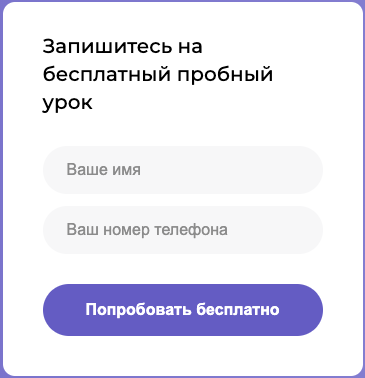

# Basics Of Web

## Head

```
.head .head__eyes .head__eyes--size_small
      .head__nose .head__nose--size_medium
      .head__mouth .head__mouth--size_large
```

## Body

```
.body .body__chest .body__chest--tatooed
      .body__waist .body__waist--slim
      .body__waist .body__waist--wide
```

## Arm
```
.arm .arm__finger .arm__finger--ring_right
     .arm__wrist .arm__wrist--wristband_right
```


# Emmet

### Header
```
header.header>nav.nav-bar>img.nav-bar__logo+div.nav-bar__links
>(ul.nav-bar__menu.menu.menu--pos-left>(li.menu__item>a.menu__link[href=''])*5)
+ul.nav-bar__menu.menu.menu--pos-right>(li.menu__item>a.menu__link[href=''])*2
+li.menu__item>a.button.button--outline[href='#']{'Бесплатный урок'}

```


### Card
```
div.methods__card.card>img.card__icon[src=''][alt='']+div.card__content>h4.card__title.title+p.card__text.text

```


### Footer
```
footer.footer>div.footer__container>(div.footer_contacts>a.footer__number+p.footer__working-hours+div.footer__social.social>((a.social__link>img)*3))+(div.footer__policy.policy>(a.policy__link*4))+div.footer__apps>img*2
```


### Form
```
form.form-card>h4.form-card__title+(label.form-card__label>input.form-card__input)+(label.form-card__label>input.form-card__input)+button.form-card__button.button.button--primary
```


